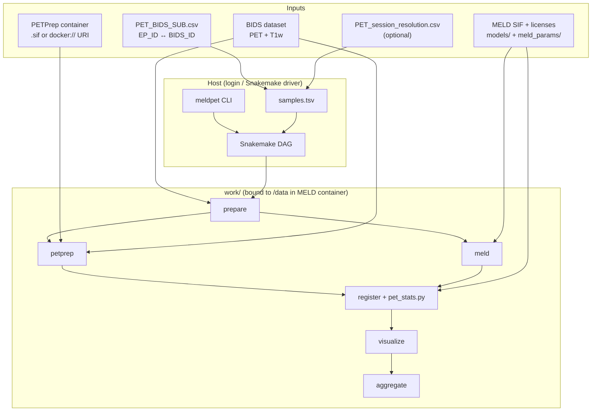
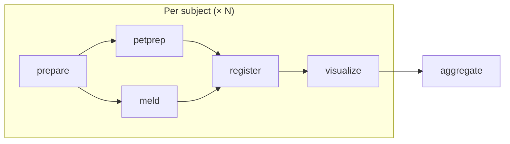
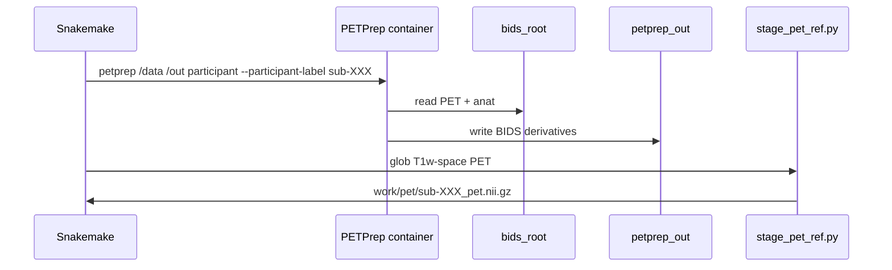
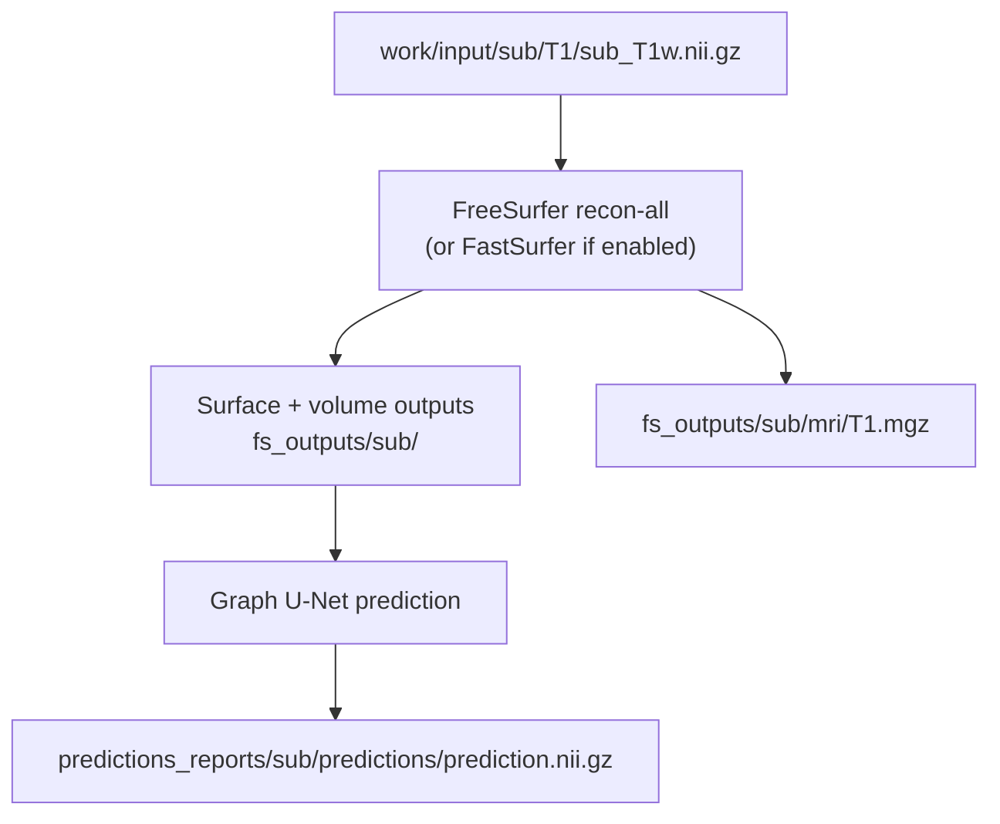
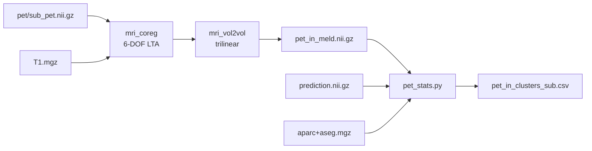

# Meld_PET — full pipeline reference

End-to-end documentation for the **MELD + PET** workflow: lesion prediction with [MELD Graph](https://github.com/MELDProject/meld_graph), PET preprocessing with [PETPrep](https://github.com/nipreps/petprep), registration into a shared anatomical grid, asymmetry/concordance statistics, and cohort roll-up.

Orchestration: **Snakemake** · User interface: **`meldpet` CLI** · Design lineage: [Meld_CBF](../Meld_CBF/) (same registration + stats pattern, PET instead of CBF).

For install/quick start see [README.md](README.md). For CLI details and thresholds see [pipeline/USER_GUIDE.md](pipeline/USER_GUIDE.md). Container internals: [meld.md](meld.md), [petprep.md](petprep.md).

---

## 1. What the pipeline does

Each subject with BIDS PET + T1w goes through:

1. **Prepare** — stage T1w into the MELD input tree (`meld_t1_only: true` by default; FLAIR is not passed to MELD).
2. **PETPrep** — preprocess PET in BIDS; produce a T1w-space reference image.
3. **MELD** — FreeSurfer recon + graph lesion prediction (`prediction.nii.gz`, `T1.mgz`).
4. **Register** — rigid PET → MELD T1 grid; compute PET↔lesion statistics.
5. **Visualize** — overlay PNGs (T1, PET, prediction).
6. **Aggregate** — cohort table + tracer-aware concordance call.

MELD and PETPrep are **independent** after prepare and can run **in parallel** on SLURM. Fusion happens only in **register**, once both branches finish.

---

## 2. High-level architecture



---

## 3. Snakemake DAG

Default target: cohort CSV + per-subject figure flags.



| Rule | Container | Typical runtime | Depends on |
|------|-----------|-----------------|------------|
| `prepare` | host (copy) | minutes | BIDS T1w in `samples.tsv` |
| `petprep` | PETPrep | ~hours | `prepare`, BIDS PET |
| `meld` | MELD Graph | ~24 h | `prepare` (T1w) |
| `register` | MELD Graph | ~1–2 h | `petprep` + `meld` |
| `visualize` | MELD Graph | ~30 min | `register` |
| `aggregate` | host (pandas) | seconds | all `register` CSVs |

Snakemake file: `pipeline/workflow/Snakefile` · Rules: `pipeline/workflow/rules/*.smk`.

---

## 4. Coordinate spaces (why a second registration)

PETPrep and MELD each produce PET/anatomy in **their own** T1w-related spaces. Statistics require one shared voxel grid.

```
  BIDS native T1w          PETPrep output              MELD / FreeSurfer
  ───────────────          ──────────────              ─────────────────
  sub_*_T1w.nii.gz   →     *_space-*T1w*pet*.nii.gz    T1.mgz (conformed)
                           (rigid to BIDS T1w)         prediction.nii.gz
                                                        (same grid as T1.mgz)

                              │                              │
                              │    mri_coreg + mri_vol2vol   │
                              └──────────────► pet_in_meld.nii.gz
                                             (MELD T1 grid)
```

**Register** runs FreeSurfer `mri_coreg` (6-DOF, mutual information) from the staged PET reference to `fs_outputs/<sub>/mri/T1.mgz`, then `mri_vol2vol` with trilinear interpolation. `pet_stats.py` and overlays assume **PET, prediction, and aparc+aseg share the MELD conformed grid**.

---

## 5. Inputs and cohort setup

### 5.1 BIDS layout

Minimum per subject/session:

```
bids_root/
└── sub-XXX/
    └── ses-N/
        ├── anat/
        │   ├── sub-XXX_ses-N_T1w.nii.gz      # required
        │   └── sub-XXX_ses-N_T1w.nii.gz       # MELD input (T1 only by default)
        └── pet/
            └── sub-XXX_ses-N_pet.nii.gz      # required for PETPrep
```

PET must be in BIDS before PETPrep. If PET exists only as raw DICOM, convert first (e.g. `dcm2niix`) or use the helper script `pipeline/workflow/scripts/stage_pet_bids.py` with site config.

### 5.2 Mapping and session pairing

| File | Columns | Purpose |
|------|---------|---------|
| `PET_BIDS_SUB.csv` | `EP_ID`, `BIDS_ID` | Cohort list (site ID ↔ BIDS subject) |
| `PET_session_resolution.csv` | `BIDS_ID`, `resolved_session` | When PET session ≠ default T1 session |

`meldpet samples` reads the mapping + optional resolution CSV and writes `pipeline/config/samples.tsv`:

```
bids_id    ep_id      session    t1w                                    flair
sub-002    EP019523   ses-3      .../sub-002/ses-3/anat/..._T1w.nii.gz  ...
```

Session choice matters: use the T1w **contemporaneous with PET** when possible (same logic as Meld_CBF).

### 5.3 Site config

Copy `pipeline/config/config.example.yaml` → `pipeline/config/config.yaml`. Key paths:

| Key | Role |
|-----|------|
| `bids_root` | BIDS root (read-only in PETPrep) |
| `work` | All pipeline outputs; mounted as `/data` in MELD container |
| `petprep_out` | PETPrep derivatives directory |
| `petprep_sif` | Apptainer image path **or** `docker://ghcr.io/nipreps/petprep:0.0.6` |
| `sif` | MELD Graph `.sif` |
| `fs_license`, `meld_license` | Bound into containers |
| `models_src`, `meld_params_src` | Read-only MELD assets |
| `tracer_mode`, `abnormal_z`, `asym_concordance_pct`, `dice_concordance` | Statistics thresholds |

Validate: `meldpet check`.

---

## 6. Work directory layout

After a full run, `work/` resembles:

```
work/
├── input/<sub>/T1/<sub>_T1w.nii.gz          ← prepare → MELD entry
├── pet/<sub>_pet.nii.gz                     ← staged PETPrep reference
├── petprep_done/<sub>/.done
├── petprep_work/<sub>/                      ← PETPrep scratch
├── petprep_derivatives/                     ← PETPrep BIDS derivatives (config: petprep_out)
├── output/
│   ├── fs_outputs/<sub>/mri/T1.mgz          ← MELD / FreeSurfer
│   ├── fs_outputs/<sub>/mri/aparc+aseg.mgz
│   ├── predictions_reports/<sub>/predictions/prediction.nii.gz
│   ├── pet_aligned/<sub>/
│   │   ├── pet_in_meld.nii.gz
│   │   ├── pet_in_clusters_<sub>.csv
│   │   └── figures/*.png
│   └── pet_cohort_stats.csv                 ← aggregate
├── logs/
│   ├── prepare_<sub>.log
│   ├── petprep_<sub>.log
│   ├── meld_<sub>.log
│   ├── register_<sub>.log
│   └── visualize_<sub>.log
└── containers/                              ← optional local .sif builds
```

Host `data/` mirrors a BIDS-style tree under `data/<sub>/<ses>/anat/` for staging copies from prepare.

---

## 7. Stage-by-stage detail

### 7.1 Prepare

**Rule:** `prepare.smk` · **Runtime:** host

```
samples.tsv (t1w, flair?)
        │
        ▼ copy
work/input/<sub>/T1/<sub>_T1w.nii.gz     ──► MELD new_pt_pipeline.py
data/<sub>/<ses>/anat/...                ──► BIDS-style mirror (T1w; FLAIR omitted when meld_t1_only)
```

No containers. Fast; safe to rerun (overwrites copies).

---

### 7.2 PETPrep

**Rule:** `petprep.smk` · **Container:** PETPrep (Apptainer or OCI URI)



Inner command (from `common.smk`):

```bash
petprep /data /out participant \
  --participant-label <sub> \
  --fs-license-file /license.txt \
  --work-dir /work
```

Binds: `bids_root→/data`, `petprep_out→/out`, license, per-subject work dir.

After PETPrep, `stage_pet_ref.py` locates the T1w-space PET using `petprep_ref_glob` (default):

```
{sub}/{session}/pet/{sub}_{session}_space-*T1w*desc-*pet*.nii.gz
```

and copies it to `work/pet/<sub>_pet.nii.gz`.

See [petprep.md](petprep.md) for image build and tool stack.

---

### 7.3 MELD

**Rule:** `meld.smk` · **Container:** MELD Graph `.sif`



Inner command:

```bash
python scripts/new_patient_pipeline/new_pt_pipeline.py -id <sub> [-fastsurfer]
```

Before each run the rule removes stale `fs_outputs`, `predictions_reports`, and `preprocessed_surf_data` for that subject to avoid mixed-version artifacts.

Container binds (`common.smk` → `apptainer_cmd`):

```
work          → /data
models_src    → /data/models:ro
meld_params   → /data/meld_params:ro
fs_license    → /license.txt:ro
meld_license  → /meld_license.txt:ro
pipeline/     → /pipeline:ro
```

See [meld.md](meld.md) for Dockerfile, entrypoint, and HPC wrapper patterns.

---

### 7.4 Register + statistics

**Rule:** `register.smk` · **Container:** MELD Graph (FreeSurfer + Python)

**Inputs:** `work/pet/<sub>_pet.nii.gz`, `T1.mgz`, `prediction.nii.gz`  
**Outputs:** `pet_in_meld.nii.gz`, `pet_in_clusters_<sub>.csv`



`pet_register_in_container.sh` orchestrates registration; `pet_stats.py` computes:

| Metric | Column(s) | Summary |
|--------|-----------|---------|
| Lesion PET intensity | `pet_mean`, `gm_z` | Mean uptake; z vs cortical GM |
| ROI asymmetry | `roi_asym_pct`, `host_roi` | Lesion ROI vs FreeSurfer homologue |
| Mirror asymmetry | `cluster_mirror_ai` | Lesion mask vs L↔R-flipped mask |
| Spatial concordance | `frac_abnormal`, `dice_abnormal` | Overlap with tracer-abnormal GM |

**Tracer modes** (`config.tracer_mode`):

- `deficit` — lower uptake abnormal (e.g. FDG hypometabolism); `abnormal_z` negative.
- `excess` — higher uptake abnormal; threshold sign flipped in logic.

If MELD finds no lesion, CSV contains `cluster=none` with empty asymmetry fields.

---

### 7.5 Visualize

**Rule:** `visualize.smk` · **Script:** `pet_visualize.py`

Produces headless PNG overlays under `work/output/pet_aligned/<sub>/figures/` (T1, PET, prediction composites). Completion marked by `figures/.done`.

---

### 7.6 Aggregate

**Rule:** `aggregate.smk` · **Script:** `aggregate_stats.py`

Concatenates per-subject CSVs → `work/output/pet_cohort_stats.csv`.

Concordance on the `all_clusters` row:

| Column | Meaning |
|--------|---------|
| `tracer_concordant` | ROI asymmetry matches tracer direction |
| `spatial_concordant` | `dice_abnormal` ≥ `dice_concordance` |
| `concordance_call` | `concordant` / `partial` / `discordant` |

For `tracer_mode: deficit`, tracer concordant when `roi_asym_pct ≤ asym_concordance_pct` (default −8%).

Run explicitly: `meldpet aggregate`, or `meldpet run --aggregate`.

---

## 8. Container binding sketch

Two images, one shared work tree for MELD-side steps:

```
┌─────────────────────────────────────────────────────────────────┐
│  Host                                                            │
│  meldpet / snakemake                                               │
└────────────┬───────────────────────────────┬────────────────────┘
             │                               │
    ┌────────▼────────┐              ┌───────▼────────┐
    │  PETPrep        │              │  MELD Graph    │
    │  apptainer exec │              │  apptainer exec│
    │                 │              │                │
    │  /data  ← bids  │              │  /data ← work  │
    │  /out   ← deriv │              │  /pipeline     │
    │  /work  ← scratch              │  licenses, models │
    └─────────────────┘              └────────────────┘
             │                               │
             └───────────┬───────────────────┘
                         ▼
              work/pet/*.nii.gz  +  work/output/fs_outputs/...
                         │
                         ▼ register (MELD container only)
```

PETPrep never mounts `work/` as `/data`; it only writes derivatives that `stage_pet_ref.py` copies into `work/pet/`.

---

## 9. CLI reference

```bash
# Setup
meldpet check
meldpet samples

# Full run (through visualize)
meldpet run sub-002 sub-036 sub-065
meldpet run --profile slurm -j 6

# With cohort table
meldpet run --aggregate
meldpet aggregate

# Individual stages
meldpet prepare | petprep | meld | register | visualize  [subjects...]

# Monitoring
meldpet status
meldpet dag -o dag.svg
meldpet -n all                    # dry-run
```

Global options: `--configfile`, `--profile slurm`, `-j`, `-n` (dry-run).

---

## 10. SLURM execution

Profile: `pipeline/profiles/slurm/config.yaml`

```bash
meldpet run --profile slurm -j 6 sub-002 sub-036 sub-065
```

Snakemake submits one job per rule×subject. Resource hints in `config.yaml` → `resources:` (overridable in profile `set-resources`).

| Rule | Default resources |
|------|-------------------|
| prepare | 4G, 1 CPU, 20 min |
| petprep | 32G, 4 CPU, 8 h |
| meld | 64G, 8 CPU, 24 h |
| register | 16G, 2 CPU, 2 h |
| visualize | 8G, 1 CPU, 30 min |

Logs: `.snakemake/slurm_logs/` and `work/logs/`. Keep the Snakemake driver process alive until all jobs complete.

---

## 11. Repository map

```
Meld_PET/
├── Meld_PET.md                 ← this document
├── README.md
├── meld.md                     ← MELD container deep dive
├── petprep.md                  ← PETPrep container deep dive
├── PET_BIDS_SUB.csv.example
├── pipeline/
│   ├── meldpet/cli.py          ← meldpet entry point
│   ├── config/config.yaml      ← site config (not committed)
│   ├── workflow/
│   │   ├── Snakefile
│   │   ├── rules/*.smk
│   │   └── scripts/
│   │       ├── build_samples.py
│   │       ├── stage_pet_ref.py
│   │       ├── stage_pet_bids.py   ← optional DICOM→BIDS PET
│   │       └── aggregate_stats.py
│   ├── pet_register_in_container.sh
│   ├── pet_stats.py
│   ├── pet_visualize.py
│   └── profiles/slurm/
└── work/                       ← outputs (gitignored)
```

---

## 12. Design notes

**Parallel branches.** MELD (FreeSurfer-heavy) and PETPrep (motion/registration/PVC-heavy) do not share intermediate files until register. This mirrors clinical practice: structural lesion modeling and PET preprocessing are independent pipelines joined at analysis time.

**Same grid as Meld_CBF.** Registration uses MELD’s conformed `T1.mgz`, not the original BIDS T1w NIfTI, so PET statistics align with the lesion mask voxel-for-voxel.

**Resumability.** Snakemake tracks file timestamps; rerunning `meldpet run` skips completed stages. MELD intentionally wipes its own stale outputs when rerun to avoid mixed FreeSurfer/prediction versions.

**Partial cohorts.** `allow_partial_aggregate: true` lets `aggregate` run when some subjects fail; set `false` for strict all-or-nothing cohort tables.

---

## 13. Citations

See [README.md — Citation](README.md#citation) for MELD Graph, PETPrep, BIDS, Snakemake, FreeSurfer, and NiPreps references.
